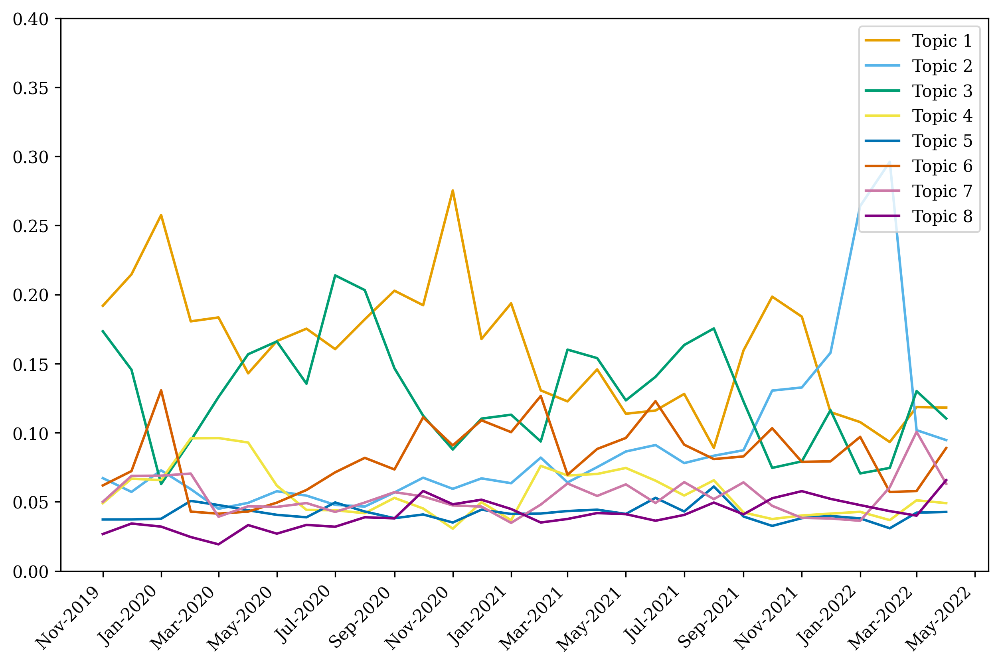
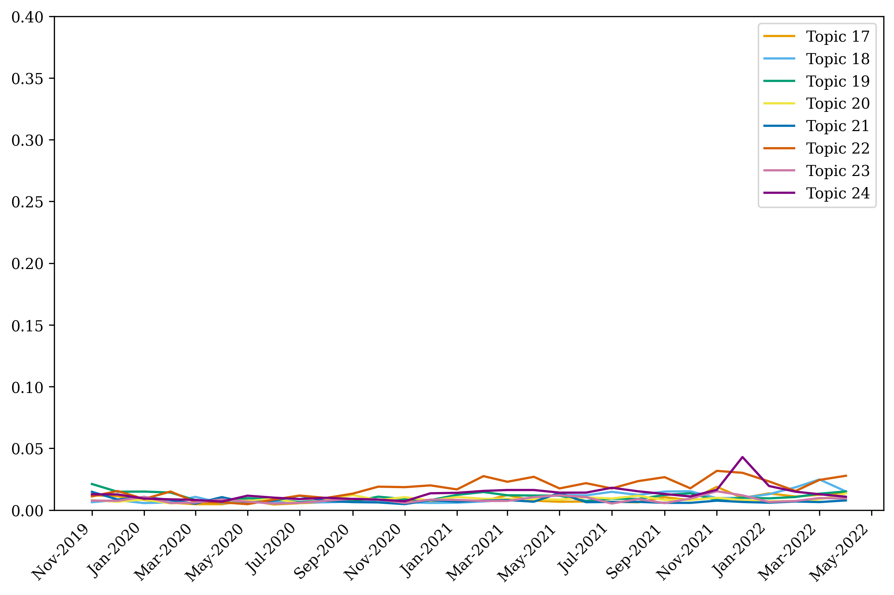
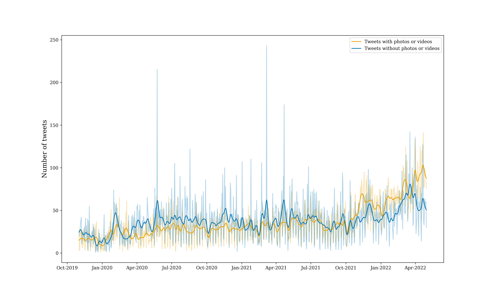

# china-twitter2

**Note:** Explain early, late and full

## Tables
### Table 1: Dataset
| Data collection                                                               |                            |
| ----------------------------------------------------------------------------- | -------------------------- |
| Date range                                                                    | Nov 1, 2019 - Apr 30, 2022 |
| Days collected                                                                | XXX                        |
|                                                                               |                            |
| Handles collected                                                             | 76                         |
| Diplomacy                                                                     | 64                         |
| Media                                                                         | 12                         |
|                                                                               |                            |
| Datasets                                                                      | Number of cases            |
| 1\. Total original tweets and retweets collected (network analysis)           | XXXXXXX                    |
| 1a. Diplomacy original tweets                                                 | 66987                      |
| 1b. Diplomacy retweets                                                        | 80876                      |
| 1c. Media original tweets                                                     | 489354                     |
| 1d. Media retweets                                                            | 43944                      |
| 2\. Subsample of original tweets in English (topic analysis)                  | 485297                     |
| 2a. Diplomacy                                                                 | 66987                      |
| 2.b Media                                                                     | 418310                     |
| 3\. Coded sample of diplomacy original tweets in English (discourse analysis) | XXXXX                      |

### Table 2: Diplomacy

| User            |   Original tweets |   Original tweets in English |   Retweets |   Retweets in English |   Total |
|:----------------|------------------:|-----------------------------:|-----------:|----------------------:|--------:|
| AmbCina         |              3855 |                            6 |        214 |                   159 |    4069 |
| AmbCuiTiankai   |               301 |                          287 |         32 |                    31 |     333 |
| AmbKongXuanyou  |                28 |                            0 |          1 |                     0 |      29 |
| AmbLiJunhua     |               283 |                          272 |         11 |                    10 |     294 |
| AmbLiuXiaoMing  |              6070 |                         5307 |         13 |                    13 |    6083 |
| AmbQinGang      |               488 |                          446 |         17 |                    17 |     505 |
| AmbZhengZeguang |               747 |                          706 |         10 |                     9 |     757 |
| Amb_ChenXu      |               591 |                          580 |         60 |                    57 |     651 |
| AmbassadeChine  |              8903 |                          257 |       2748 |                   719 |   11651 |
| CCGBelfast      |               228 |                          221 |        321 |                   292 |     549 |
| CGHuangPingNY   |               332 |                          332 |         32 |                    32 |     364 |
| CGMeifangZhang  |              6298 |                         5553 |       6684 |                  5612 |   12982 |
| CGZhangPingLA   |               222 |                          220 |         21 |                    21 |     243 |
| CHN_UN_NY       |               533 |                          492 |       2602 |                  2442 |    3135 |
| Cao_Li_CHN      |               583 |                          522 |        355 |                   320 |     938 |
| ChinaAmbUN      |              1384 |                         1203 |        830 |                   772 |    2214 |
| ChinaCGCalgary  |              2461 |                         2413 |         19 |                    19 |    2480 |
| ChinaCGMTL      |              1419 |                          521 |        282 |                   155 |    1701 |
| ChinaCG_Ffm     |               151 |                           30 |         73 |                    34 |     224 |
| ChinaCG_HH      |               653 |                           34 |        479 |                   152 |    1132 |
| ChinaCG_Muc     |               372 |                           16 |        232 |                   129 |     604 |
| ChinaCG_NYC     |               631 |                          623 |        275 |                   275 |     906 |
| ChinaConSydney  |              4642 |                         4619 |        468 |                   454 |    5110 |
| ChinaConsulate  |              1348 |                         1300 |        123 |                   122 |    1471 |
| ChinaEUMission  |              3776 |                         3250 |        623 |                   576 |    4399 |
| ChinaEmbEsp     |              4473 |                            2 |        272 |                    51 |    4745 |
| ChinaEmbGermany |              2303 |                           72 |        752 |                   555 |    3055 |
| ChinaEmbOttawa  |              1767 |                         1684 |        907 |                   896 |    2674 |
| ChinaInDenmark  |              1046 |                         1010 |        481 |                   466 |    1527 |
| ChinaMissionGva |              2096 |                         1939 |       3187 |                  3093 |    5283 |
| ChinaMissionVie |              1478 |                         1474 |        213 |                   207 |    1691 |
| China_Lyon      |                50 |                            3 |        802 |                   121 |     852 |
| China_Ukraine_  |               152 |                            5 |         30 |                    26 |     182 |
| ChinainVan      |               418 |                          409 |        355 |                   345 |     773 |
| Chinamission2un |              2991 |                         2826 |       2706 |                  2568 |    5697 |
| ChineseCon_Mel  |               500 |                          492 |         35 |                    35 |     535 |
| ChineseEmbinRus |               861 |                           24 |         25 |                    20 |     886 |
| ChineseEmbinUK  |              3400 |                         3025 |        233 |                   232 |    3633 |
| ChineseEmbinUS  |              1347 |                         1262 |        648 |                   630 |    1995 |
| ChnConsul_osaka |              1964 |                           12 |       1543 |                   112 |    3507 |
| ChnConsulateFuk |               710 |                            6 |        972 |                    26 |    1682 |
| ChnConsulateNag |               651 |                            0 |        154 |                    20 |     805 |
| ChnConsulateNgo |               550 |                            0 |        699 |                    43 |    1249 |
| ChnConsulateNgt |               329 |                            0 |         60 |                     7 |     389 |
| ChnEmbassy_jp   |              2614 |                           18 |       1319 |                   349 |    3933 |
| ChnMission      |               121 |                           91 |       1033 |                   969 |    1154 |
| ConsulChinaBcn  |              1166 |                           15 |        121 |                    38 |    1287 |
| ConsulateSan    |               105 |                           64 |       2750 |                  2737 |    2855 |
| DIOC_MFA_China  |               179 |                          173 |          5 |                     5 |     184 |
| FuCong17        |               156 |                          152 |        359 |                   351 |     515 |
| FukLyuGuijun    |                65 |                            0 |         63 |                     1 |     128 |
| GeneralkonsulDu |               291 |                           23 |        325 |                   102 |     616 |
| Li_Yang_China   |              1211 |                          984 |        178 |                   139 |    1389 |
| MFA_China       |              3265 |                         3122 |       2628 |                  1999 |    5893 |
| SpokespersonCHN |              6077 |                         5599 |        376 |                   339 |    6453 |
| SpokespersonHZM |               382 |                          361 |         40 |                    40 |     422 |
| SpoxCHNinUS     |               828 |                          801 |        259 |                   248 |    1087 |
| WangLutongMFA   |                90 |                           84 |          0 |                     0 |      90 |
| WuPeng_MFAChina |              1994 |                         1974 |          0 |                     0 |    1994 |
| XIEYongjun_CHN  |              1540 |                         1018 |         72 |                    66 |    1612 |
| Zhou_Li_CHN     |               617 |                          581 |        236 |                   222 |     853 |
| chinacgedi      |               304 |                          290 |        248 |                   240 |     552 |
| chinascio       |              4353 |                         4335 |        155 |                   152 |    4508 |
| consulat_de     |               989 |                           18 |       2695 |                  1189 |    3684 |
| xuejianosaka    |              3645 |                            2 |      22745 |                  3795 |   26390 |
| zhaobaogang2011 |               460 |                          420 |        887 |                   849 |    1347 |
| zhu_jingyang    |              1969 |                           50 |        257 |                    87 |    2226 |
| zlj517          |              3459 |                         3357 |      13526 |                 12551 |   16985 |

### Table 3: Media
| User            |   Original tweets |   Original tweets in English |   Retweets |   Retweets in English |   Total |
|:----------------|------------------:|-----------------------------:|-----------:|----------------------:|--------:|
| CGTNOfficial    |            101591 |                        99765 |      16526 |                 16458 |  118117 |
| CNS1952         |             36706 |                            0 |          5 |                     0 |   36711 |
| ChinaDaily      |             64846 |                        64410 |       2435 |                  2355 |   67281 |
| Echinanews      |             31418 |                        31284 |         26 |                    25 |   31444 |
| HuXijin_GT      |              1528 |                         1524 |         49 |                    49 |    1577 |
| PDChina         |             32467 |                        32391 |        158 |                   158 |   32625 |
| PDChinese       |             26142 |                            1 |          0 |                     0 |   26142 |
| QiushiJournal   |              1131 |                         1095 |          0 |                     0 |    1131 |
| XHNews          |             75318 |                        74990 |         37 |                    37 |   75355 |
| XinWen_Ch       |              3324 |                          141 |        316 |                    26 |    3640 |
| chenweihua      |             17593 |                        16607 |      23045 |                 22296 |   40638 |
| globaltimesnews |             87304 |                        86805 |        684 |                   619 |   87988 |
| shen_shiwei     |              9986 |                         9297 |        663 |                   633 |   10649 |

## Figures
### Figure X (full data) open [here](http://htmlpreview.github.io/?https://github.com/centre-for-humanities-computing/china-twitter2/blob/main/topic_model/fig/topic_model_diplomat_alldates.html)

### Figure Xa


### Figure Xb


### Figure Xc


### Figure X


### Figure X


### Figure X


### Figure X


## Topic analysis
A topic model was created for each of the three time periods. Latent Dirichlet Allocation topic modelling using `gensim` package in Python (See documentation: https://radimrehurek.com/gensim_3.8.3/models/ldamodel.html). 
LDA is a hierarchical Bayesian model with three levels, in which each item of a collection, in this case tweets, is modeled as a finite mixture over an underlying set of topics. In turn, each topic is modeled as an infinite mixture over an underlying set of topic probabilities. An explicit representation of each tweet is provided by the topic probabilities. 

A total of 180 models were trained for both diplomat and media tweets in each time period with a variation of the following three hyperparameters:
* Number of Topics (K)
    * The topic model was trained requesting 10, 15, 20, 25, 30 and 35 latent topics
* Dirichlet hyperparameter alpha: A-priori document-topic density
    * The topic model was trained using 6 different a-priori beliefs about the document-topic density, including 0.01, 0.31, 0.61, 0.91, symmetric ) and asymmetric )
* Dirichlet hyperparameter beta: A-priori word-topic density
    * The topic model was trained using 5 different a-priori beliefs about the word-topic density, including 0.01, 0.31, 0.61, 0.91 and symmetric )

The model with the best  coherence score is chosen for analysis.

## Network analysis
Network analysis performed using the networkx package in python (https://networkx.org/) and the network visualizations are generated from the file ```network_main.py``` (see usage below). 
Nodes in the networks are Twitter handles, and edges (connections) are weighted by the number of mentions between the Twitter handles that are displayed. 
The network visualizations only plot Twitter handles that are either flagged as (i) Chinese diplomats or (ii) Chinese media outlets. 
The *edgewidth* (strength of connections) is determined by the number of mentions between Twitter handles of Chinese diplomats and media outlets (see below). 
The *nodesize* (size of handle) is determined by various attributes, such as: 
* *total mentions*: number of total mentions to the Twitter handle in question from all users (also non-diplomats and non-media that are not shown as nodes in the plot). This shows how "popular" the Chinese diplomats and media outlets are on Twitter broadly, rather than just their popularity/activity within the diplomat/media sub-network. 
* *weighted degree*: node-size scaled by number of total number of connections between Twitter handle in question and other Chinese diplomats and media outlets (both directions counted, and each mention counted). The weighted degree plot corresponds to *in-degree* + *out-degree* (i.e. we count both directions). 
* *in-degree*: number of mentions from other Chinese diplomats and media outlets to the Twitter handle in question (only one direction counted). 
* *out-degree*: number of mentions from the Twitter handle in question to other Chinese diplomats and media outlets (only one direction counted). 

In addition to the network visualizations, we also show the top 10 handles (based on *weighted degree*). 

## Emotion analysis
Emotion classification was conducted using a DistilBERT model finetuned for emotion classification. The finetuned model can be found on [HuggingFace](https://huggingface.co/bhadresh-savani/distilbert-base-uncased-emotion). 


## Use of photos and videos
