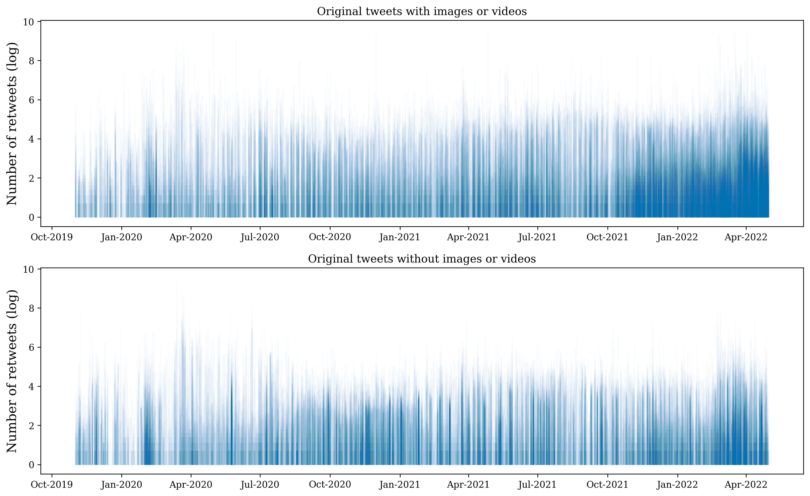

# china-twitter2
## Tables
### Table 1: Dataset
| Data collection                                                               |                            |
| ----------------------------------------------------------------------------- | -------------------------- |
| Date range                                                                    | Nov 1, 2019 - Apr 30, 2022 |
| Days collected                                                                | 912                        |
|                                                                               |                            |
| Handles collected                                                             | 81                         |
| Diplomacy                                                                     | 68                         |
| Media                                                                         | 13                         |
|                                                                               |                            |
| Datasets                                                                      | Number of cases            |
| 1\. Total original tweets and retweets collected (network analysis)           | 723439                     |
| 1a. Diplomacy original tweets                                                 | 109265                     |
| 1b. Diplomacy retweets                                                        | 80876                      |
| 1c. Media original tweets                                                     | 489354                     |
| 1d. Media retweets                                                            | 43944                      |
| 2\. Subsample of original tweets in English (topic analysis)                  | 485297                     |
| 2a. Diplomacy                                                                 | 66987                      |
| 2.b Media                                                                     | 418310                     |
| 3\. Coded sample of diplomacy original tweets in English (discourse analysis) | XXXXX                      |

### Table 2: Diplomacy

| User            | Description                                                                                                                                                                                                                      |   Original tweets |   Original tweets in English |   Retweets |   Retweets in English |   Total |
|:----------------|:---------------------------------------------------------------------------------------------------------------------------------------------------------------------------------------------------------------------------------|------------------:|-----------------------------:|-----------:|----------------------:|--------:|
| AmbCina         | Embassy of the P.R.C. in Rome, Italy                                                                                                                                                                                             |              3855 |                            6 |        214 |                   159 |    4069 |
| AmbCuiTiankai   | CUI Tiankai, former Chinese Ambassador to the U.S. (2013-2021)                                                                                                                                                                   |               301 |                          287 |         32 |                    31 |     333 |
| AmbKongXuanyou  | KONG Xuanyou, Chinese Ambassador to Japan (2019-2023)                                                                                                                                                                            |                28 |                            0 |          1 |                     0 |      29 |
| AmbLiJunhua     | LI Junhua, Ambassador Extraordinary and Plenipotentiary of China to Italy and San Marino (2019-2022)                                                                                                                             |               283 |                          272 |         11 |                    10 |     294 |
| AmbLiuXiaoMing  | LIU Xiaoming, Chinese Ambassador to the U.K. (2010-2021)                                                                                                                                                                         |              6070 |                         5307 |         13 |                    13 |    6083 |
| AmbQinGang      | QIN Gang, Chinese ambassador to the US (2021-2023)                                                                                                                                                                               |               488 |                          446 |         17 |                    17 |     505 |
| AmbZhengZeguang | ZHENG Zeguang Chinese Ambassador to the UK (2021-)                                                                                                                                                                               |               747 |                          706 |         10 |                     9 |     757 |
| Amb_ChenXu      | CHEN Xu, Ambassador, Permanent Representative of the P.R.C. to the U.N. office in Geneva, Switzerland (2019-)                                                                                                                    |               591 |                          580 |         60 |                    57 |     651 |
| AmbassadeChine  | Embassy of the P.R.C. in Paris, France                                                                                                                                                                                           |              8903 |                          257 |       2748 |                   719 |   11651 |
| CCGBelfast      | Consulate General of the P.R.C. in Belfast, U.K.                                                                                                                                                                                 |               228 |                          221 |        321 |                   292 |     549 |
| CGHuangPingNY   | HUANG Ping, Chinese Consul General in New York (2018-)                                                                                                                                                                           |               332 |                          332 |         32 |                    32 |     364 |
| CGMeifangZhang  | ZHANG Meifang, Consul General of China in Belfast (2022-)                                                                                                                                                                        |              6298 |                         5553 |       6684 |                  5612 |   12982 |
| CGZhangPingLA   | ZHANG Ping, Consul General of the People's Republic of China in Los Angeles (2017-2022)                                                                                                                                          |               222 |                          220 |         21 |                    21 |     243 |
| CHN_UN_NY       | Spokesperson of Mission of the P.R.C. to the U.N.                                                                                                                                                                                |               533 |                          492 |       2602 |                  2442 |    3135 |
| Cao_Li_CHN      | Cao Li, Counsellor, Information Department, MFA, China (2021-)                                                                                                                                                                   |               583 |                          522 |        355 |                   320 |     938 |
| ChinaAmbUN      | ZHANG Jun, Ambassador, Permanent Representative of the P.R.C. to the U.N. (2019-)                                                                                                                                                |              1384 |                         1203 |        830 |                   772 |    2214 |
| ChinaCGCalgary  | Consulate General of the P.R.C. in Calgary, Canada                                                                                                                                                                               |              2461 |                         2413 |         19 |                    19 |    2480 |
| ChinaCGMTL      | Consulate General of the P.R.C. in Montreal, Canada                                                                                                                                                                              |              1419 |                          521 |        282 |                   155 |    1701 |
| ChinaCG_Ffm     | Consulate General of the People's Republic of China in Frankfurt am Main                                                                                                                                                         |               151 |                           30 |         73 |                    34 |     224 |
| ChinaCG_HH      | Consulate General of the People's Republic of China in Hamburg                                                                                                                                                                   |               653 |                           34 |        479 |                   152 |    1132 |
| ChinaCG_Muc     | Chinese Consulate General in Munich                                                                                                                                                                                              |               372 |                           16 |        232 |                   129 |     604 |
| ChinaCG_NYC     | Consulate General of the PRC  in New York                                                                                                                                                                                        |               631 |                          623 |        275 |                   275 |     906 |
| ChinaConSydney  | Consulate General of the P.R.C. in Sydney, Australia                                                                                                                                                                             |              4642 |                         4619 |        468 |                   454 |    5110 |
| ChinaConsulate  | Consulate General of the P.R.C. in Chicago, U.S.                                                                                                                                                                                 |              1348 |                         1300 |        123 |                   122 |    1471 |
| ChinaEUMission  | Mission of the P.R.C. to the E.U.                                                                                                                                                                                                |              3776 |                         3250 |        623 |                   576 |    4399 |
| ChinaEmbEsp     | Chinese Embassy in Spain                                                                                                                                                                                                         |              4473 |                            2 |        272 |                    51 |    4745 |
| ChinaEmbGermany | Embassy of the P.R.C. in Berlin, Germany                                                                                                                                                                                         |              2303 |                           72 |        752 |                   555 |    3055 |
| ChinaEmbOttawa  | Embassy of the P.R.C. in Ottawa, Canada                                                                                                                                                                                          |              1767 |                         1684 |        907 |                   896 |    2674 |
| ChinaInDenmark  | Embassy of the P.R.C. in Copenhagen, Denmark                                                                                                                                                                                     |              1046 |                         1010 |        481 |                   466 |    1527 |
| ChinaMissionGva | Mission of the P.R.C. to the U.N. office in Geneva, Switzerland                                                                                                                                                                  |              2096 |                         1939 |       3187 |                  3093 |    5283 |
| ChinaMissionVie | Mission of the P.R.C. to the U.N. office in Vienna, Austria                                                                                                                                                                      |              1478 |                         1474 |        213 |                   207 |    1691 |
| China_Lyon      | Consulate General of the P.R.C. in Lyon, France                                                                                                                                                                                  |                50 |                            3 |        802 |                   121 |     852 |
| China_Ukraine_  | Chinese Embassy in Ukraine                                                                                                                                                                                                       |               152 |                            5 |         30 |                    26 |     182 |
| ChinainVan      | Consulate General of the P.R.C. in Vancouver, Canada                                                                                                                                                                             |               418 |                          409 |        355 |                   345 |     773 |
| Chinamission2un | Mission of the P.R.C. to the U.N.                                                                                                                                                                                                |              2991 |                         2826 |       2706 |                  2568 |    5697 |
| ChineseCon_Mel  | Chinese Consulate-General in Melbourne                                                                                                                                                                                           |               500 |                          492 |         35 |                    35 |     535 |
| ChineseEmbinRus | Chinese Embassy in Russia                                                                                                                                                                                                        |               861 |                           24 |         25 |                    20 |     886 |
| ChineseEmbinUK  | Embassy of the P.R.C. in London, U.K.                                                                                                                                                                                            |              3400 |                         3025 |        233 |                   232 |    3633 |
| ChineseEmbinUS  | Embassy of the P.R.C. in Washington, D.C., U.S.                                                                                                                                                                                  |              1347 |                         1262 |        648 |                   630 |    1995 |
| ChnConsul_osaka | Consulate General of the P.R.C. in Osaka, Japan                                                                                                                                                                                  |              1964 |                           12 |       1543 |                   112 |    3507 |
| ChnConsulateFuk | Consulate-General of the P. R. C. in Fukuoka                                                                                                                                                                                     |               710 |                            6 |        972 |                    26 |    1682 |
| ChnConsulateNag | Consulate-General of the P. R. C. in Nagasaki                                                                                                                                                                                    |               651 |                            0 |        154 |                    20 |     805 |
| ChnConsulateNgo | Consulate-General of the P. R. C. in Nagoya                                                                                                                                                                                      |               550 |                            0 |        699 |                    43 |    1249 |
| ChnConsulateNgt | Consulate-General of the P. R. C. in Niigata                                                                                                                                                                                     |               329 |                            0 |         60 |                     7 |     389 |
| ChnEmbassy_jp   | Embassy of the P.R.C. in Tokyo, Japan                                                                                                                                                                                            |              2614 |                           18 |       1319 |                   349 |    3933 |
| ChnMission      | LIU Yuyin, Spokesperson, Permanent Representative of the P.R.C. to the U.N. office in Geneva, Switzerland (2019-)                                                                                                                |               121 |                           91 |       1033 |                   969 |    1154 |
| ConsulChinaBcn  | Consulate General of China in Barcelona                                                                                                                                                                                          |              1166 |                           15 |        121 |                    38 |    1287 |
| ConsulateSan    | Chinese Consulate General in San Francisco                                                                                                                                                                                       |               105 |                           64 |       2750 |                  2737 |    2855 |
| DIOC_MFA_China  | Department of International Organizations and Conferences, MFA, China                                                                                                                                                            |               179 |                          173 |          5 |                     5 |     184 |
| FuCong17        | Fu Cong, Chinese Ambassador to the EU (2022-)                                                                                                                                                                                    |               156 |                          152 |        359 |                   351 |     515 |
| FukLyuGuijun    | Consul General of the P. R. C. in Fukuoka (2020-)                                                                                                                                                                                |                65 |                            0 |         63 |                     1 |     128 |
| GeneralkonsulDu | DU Xiaohui, Consul General, Consulate General of the P.R.C. to Hamburg, Germany                                                                                                                                                  |               291 |                           23 |        325 |                   102 |     616 |
| Li_Yang_China   | Li Yang, Counsellor of Department of Information, MFA, China. (2021-)                                                                                                                                                            |              1211 |                          984 |        178 |                   139 |    1389 |
| MFA_China       | Ministry of Foreign Affairs, Beijing, P.R.C.                                                                                                                                                                                     |              3265 |                         3122 |       2628 |                  1999 |    5893 |
| SpokespersonCHN | HUA Chunying, Spokesperson & Director General, Information Department, Ministry of Foreign Affairs, Beijing, P.R.C. (2019-2021). Assistant Minister of Foreign Affairs (2021-).                                                  |              6077 |                         5599 |        376 |                   339 |    6453 |
| SpokespersonHZM | HU Zhaoming, Spokesperson & Director General, Bureau of Public Information and Communication, International Department, CPC Central Committee (2019-)                                                                            |               382 |                          361 |         40 |                    40 |     422 |
| SpoxCHNinUS     | Liu Pengyu, Spokesperson of Chinese Embassy in the U.S. (2021-)                                                                                                                                                                  |               828 |                          801 |        259 |                   248 |    1087 |
| WangLutongMFA   | Wang Lutong, Director General for European Affairs, MFA, China (2019-)                                                                                                                                                           |                90 |                           84 |          0 |                     0 |      90 |
| WuPeng_MFAChina | Wu Peng, Director-General, Department of African Affairs, MFA, China (2020-)                                                                                                                                                     |              1994 |                         1974 |          0 |                     0 |    1994 |
| XIEYongjun_CHN  | Xie Yongjun, Head of Division, Info Dept, MFA, China                                                                                                                                                                             |              1540 |                         1018 |         72 |                    66 |    1612 |
| Zhou_Li_CHN     | Zhou Li, Counsellor, Information Department of Foreign Ministry, China (2002-)                                                                                                                                                   |               617 |                          581 |        236 |                   222 |     853 |
| chinacgedi      | Consulate General of the P.R.C. in Edinburgh, U.K.                                                                                                                                                                               |               304 |                          290 |        248 |                   240 |     552 |
| chinascio       | State Council Information Office of the P.R.C.                                                                                                                                                                                   |              4353 |                         4335 |        155 |                   152 |    4508 |
| consulat_de     | Consulate General of the P.R.C. in Strasbourg, France                                                                                                                                                                            |               989 |                           18 |       2695 |                  1189 |    3684 |
| xuejianosaka    | Xue Jian, Consul General of P.R.C  in Osaka (2021-)                                                                                                                                                                              |              3645 |                            2 |      22745 |                  3795 |   26390 |
| zhaobaogang2011 | Zhao Baogang, African Affairs Department of Chinese Foreign Ministry (2021-2023)                                                                                                                                                 |               460 |                          420 |        887 |                   849 |    1347 |
| zhu_jingyang    | Zhu Jingyang, Consul General of P.R.C  in Barcelona (2021-)                                                                                                                                                                      |              1969 |                           50 |        257 |                    87 |    2226 |
| zlj517          | ZHAO Lijian, Spokesperson & Deputy Director General, Information Department, Ministry of Foreign Affairs, Beijing, P.R.C. (2019-2023). Deputy Director-General of the Department of Boundary and Ocean Affairs of China (2023-). |              3459 |                         3357 |      13526 |                 12551 |   16985 |

### Table 3: Media
| User            | Description                                              |   Original tweets |   Original tweets in English |   Retweets |   Retweets in English |   Total |
|:----------------|:---------------------------------------------------------|------------------:|-----------------------------:|-----------:|----------------------:|--------:|
| CGTNOfficial    | China Global Television Network (CGTN)                   |            101591 |                        99765 |      16526 |                 16458 |  118117 |
| CNS1952         | China News Service                                       |             36706 |                            0 |          5 |                     0 |   36711 |
| ChinaDaily      | China Daily                                              |             64846 |                        64410 |       2435 |                  2355 |   67281 |
| Echinanews      |                                                          |             31418 |                        31284 |         26 |                    25 |   31444 |
| HuXijin_GT      | HU Xijin, Global Times Editor-in-chief                   |              1528 |                         1524 |         49 |                    49 |    1577 |
| PDChina         | People's Daily                                           |             32467 |                        32391 |        158 |                   158 |   32625 |
| PDChinese       | People's Daily (Chinese)                                 |             26142 |                            1 |          0 |                     0 |   26142 |
| QiushiJournal   | Qiushi Journal                                           |              1131 |                         1095 |          0 |                     0 |    1131 |
| XHNews          | Xinhua News                                              |             75318 |                        74990 |         37 |                    37 |   75355 |
| XinWen_Ch       | Voice of China                                           |              3324 |                          141 |        316 |                    26 |    3640 |
| chenweihua      | CHEN Weihua, China Daily E.U. Bureau Chief and columnist |             17593 |                        16607 |      23045 |                 22296 |   40638 |
| globaltimesnews | Global Times                                             |             87304 |                        86805 |        684 |                   619 |   87988 |
| shen_shiwei     | SHEN Shiwei, CGTN News Producer                          |              9986 |                         9297 |        663 |                   633 |   10649 |

## Figures

### Network analysis
Network visualisation of Chinese diplomats and media outlets on Twitter in the early period (Nov 2019 - Apr 2020). Node size shows the in-degree of the node. 

#### Figure 1a
Visualisation of the early period, where nodesize indicates the in-degree of the node.


#### Figure 1b
Visualisation of the early period, where nodesize indicates the out-degree of the node.


#### Figure 1c
Network visualisation of Chinese diplomats and media outlets on Twitter in the late period (Nov 2021 - Apr 2022). Node size shows the in-degree of the node.


#### Figure 1d
Visualisation of the late period, where nodesize indicates the out-degree of the node.


### Topic model
#### Figure 2
Interactive plot of topics. Open [here](http://htmlpreview.github.io/?https://github.com/centre-for-humanities-computing/china-twitter2/blob/main/topic_model/fig/topic_model_diplomat_alldates.html).

#### Figure 3a


#### Figure 3b


#### Figure 3c


#### Figure 3d


### Media use
#### Figure 4
Number of tweets with and without media (photos and videos) over time.


#### Figure 5
Retweets over time for tweets with and without media (photos and videos). Each tweet is represented by a blue line, where the height of the line corresponds to the number of retweets on the log scale. Each tweet is plotted with a semi-transparent line to show the density of the data, i.e. the darker the area, the more tweets. 



### Sentiment analysis
Normalised emotion distribution over time for chinese diplomats original tweets


Information dynamics of the emotion distribution over time for chinese diplomats original tweets. Background color represents shifts in variance.


## Topic analysis
A topic model was created using the diplomat tweets. Latent Dirichlet Allocation topic modelling using `gensim` package in Python (See documentation: https://radimrehurek.com/gensim_3.8.3/models/ldamodel.html). 
LDA is a hierarchical Bayesian model with three levels, in which each item of a collection, in this case tweets, is modeled as a finite mixture over an underlying set of topics. In turn, each topic is modeled as an infinite mixture over an underlying set of topic probabilities. An explicit representation of each tweet is provided by the topic probabilities. 

A total of 180 models were trained for both diplomat and media tweets in each time period with a variation of the following three hyperparameters:
* Number of Topics (K)
    * The topic model was trained requesting 10, 15, 20, 25, 30 and 35 latent topics
* Dirichlet hyperparameter alpha: A-priori document-topic density
    * The topic model was trained using 6 different a-priori beliefs about the document-topic density, including 0.01, 0.31, 0.61, 0.91, symmetric ) and asymmetric )
* Dirichlet hyperparameter beta: A-priori word-topic density
    * The topic model was trained using 5 different a-priori beliefs about the word-topic density, including 0.01, 0.31, 0.61, 0.91 and symmetric )

The model with the best  coherence score is chosen for analysis.

## Network analysis
Network analysis performed using the networkx package in python (https://networkx.org/) and the network visualizations are generated from the file ```network_main.py``` (see usage below). 
Nodes in the networks are Twitter handles, and edges (connections) are weighted by the number of mentions between the Twitter handles that are displayed. 
The network visualizations only plot Twitter handles that are either flagged as (i) Chinese diplomats or (ii) Chinese media outlets. 
The *edgewidth* (strength of connections) is determined by the number of mentions between Twitter handles of Chinese diplomats and media outlets (see below). 
The *nodesize* (size of handle) is determined by various attributes, such as: 
* *total mentions*: number of total mentions to the Twitter handle in question from all users (also non-diplomats and non-media that are not shown as nodes in the plot). This shows how "popular" the Chinese diplomats and media outlets are on Twitter broadly, rather than just their popularity/activity within the diplomat/media sub-network. 
* *weighted degree*: node-size scaled by number of total number of connections between Twitter handle in question and other Chinese diplomats and media outlets (both directions counted, and each mention counted). The weighted degree plot corresponds to *in-degree* + *out-degree* (i.e. we count both directions). 
* *in-degree*: number of mentions from other Chinese diplomats and media outlets to the Twitter handle in question (only one direction counted). 
* *out-degree*: number of mentions from the Twitter handle in question to other Chinese diplomats and media outlets (only one direction counted). 

In addition to the network visualizations, we also show the top 10 handles (based on *weighted degree*). 

## Emotion analysis
Emotion classification was conducted using a DistilBERT model finetuned for emotion classification. The finetuned model can be found on [HuggingFace](https://huggingface.co/bhadresh-savani/distilbert-base-uncased-emotion). The [NewsFluxus](https://github.com/centre-for-humanities-computing/newsFluxus) package was used to investigate the information dynamics of the emotion distribution over time.


## Use of photos and videos
To investigate the dynamics of the diplomats' use of photos and videos (media), measures such as the count and proportion of tweets with media, as well as the number of retweets were plotted over time. See the ```media_use``` directory for plots and scripts.